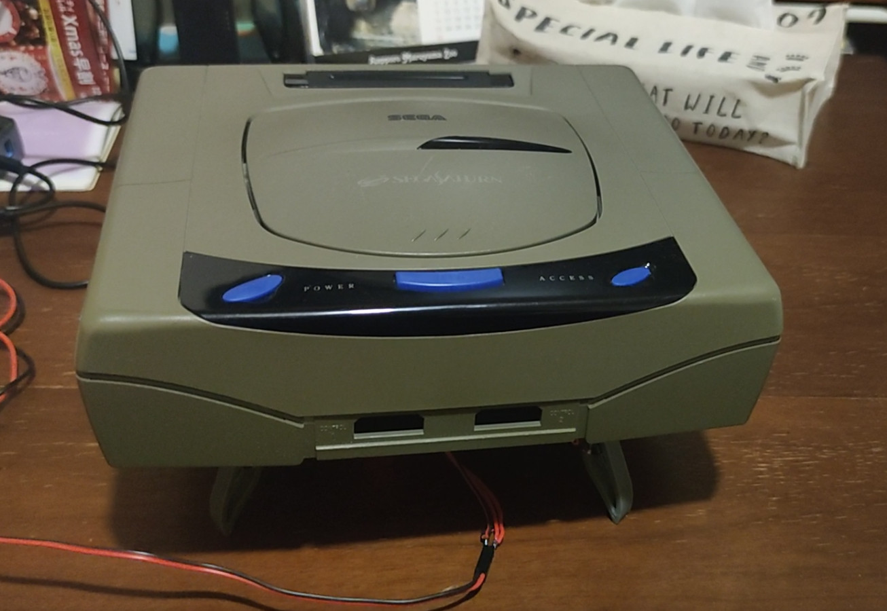
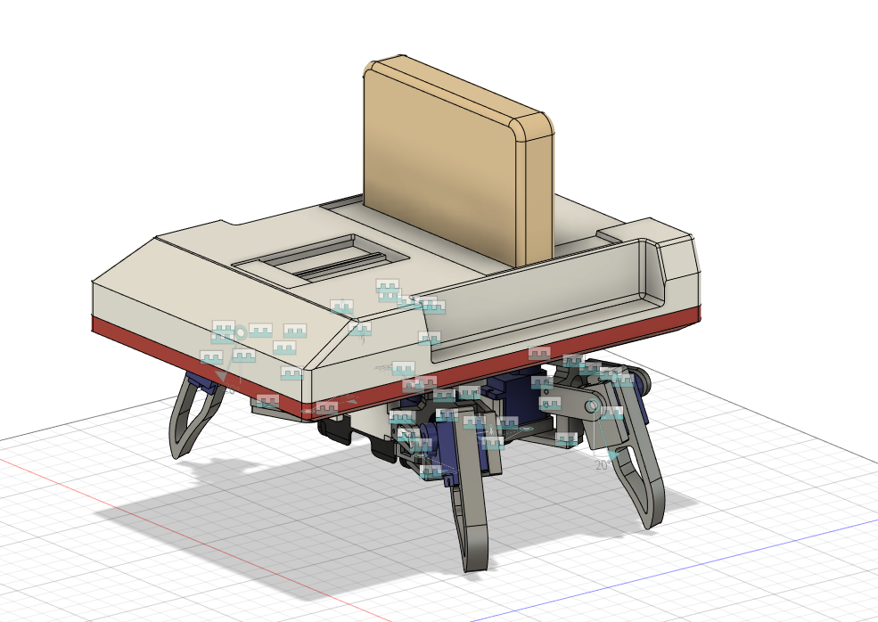
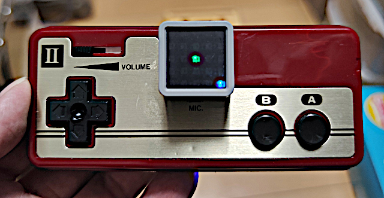

# M5 Quadrupted Spider Robot Retro Game Machine version

This is the open source hawdware project.

## Nintendo Famicon version

## SEGA Saturn bersion

## CAD image

## Function check

## Controller (M5AtomPad)

<https://github.com/tomorrow56/M5AtomPad>

## Youtube
<https://youtu.be/02uRKkd1d6U>

## Protopedia
https://protopedia.net/prototype/3902
